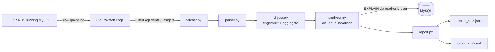

# slowlog-agent

[](https://github.com/hashir-Zahoor-kh/slowlog-agent/actions/workflows/ci.yml)
[](.github/workflows/ci.yml)
[](https://pypi.org/project/slowlog-agent/)
[](LICENSE)
[](https://github.com/astral-sh/ruff)

**slowlog-agent** pulls your MySQL slow query log from CloudWatch on demand,
aggregates it into a query digest, hands that digest to Claude (headless,
with live `EXPLAIN` access against a read-only DB user), and gives you back a
schema-validated JSON report plus a human-readable Markdown report — ranked
findings, evidence, and suggested fixes, in one command.

It is **on-demand only**: no scheduler, no agent running in your infra, no
standing access beyond a scoped IAM read role. You run it when you want an
answer; it does its work and exits.



## 60-second quickstart

```bash
uvx slowlog-agent init      # pick an AWS profile, a log group, optionally a read-only DB DSN
slowlog analyze             # fetch, digest, analyze, and write reports/report_<ts>.{json,md}
```

That's it. `init` writes `slowlog.toml` and runs the same checks as `slowlog
doctor` as its last step, so by the time it finishes you already know
whether `analyze` will work.

## Sample report output

````markdown
# Slow Query Analysis Report

- **Generated:** 2026-07-16T12:00:00+00:00
- **Window:** 2026-07-15T00:00:00 to 2026-07-16T00:00:00
- **Log entries parsed:** 812 (3 skipped during parsing)
- **Patterns analyzed:** 10
- **DB-verified (EXPLAIN executed):** Yes

## Summary

One critical full-table-scan pattern accounts for most of the slow-log
time in this window; adding a single index resolves it.

## Findings

| # | Severity | Fingerprint | Problem |
|---|---|---|---|
| 1 | CRITICAL | `select * from orders where customer_email = ?` | Full table scan on orders.customer_email for a high-frequency pattern. |

## Details

### 1. [CRITICAL] select * from orders where customer_email = ?

**Problem:** Full table scan on orders.customer_email for a high-frequency pattern.

**Evidence:** EXPLAIN shows type=ALL, key=NULL, rows=4400312 for this pattern's example query.

**Recommendation:** Add a secondary index on orders(customer_email).

**Suggested DDL:**

```sql
CREATE INDEX idx_orders_customer_email ON orders (customer_email);
```

**Estimated impact:** Rows examined should drop from ~4.4M to a handful per query.
````

## Configuration reference

Settings load from `slowlog.toml` in the current directory, overlaid by
`SLOWLOG_*` environment variables (env wins). `slowlog init` writes the toml
file for you.

| Setting | Env var | TOML key | Default | Required |
|---|---|---|---|---|
| CloudWatch log group | `SLOWLOG_LOG_GROUP_NAME` | `log_group_name` | — | yes |
| AWS region | `SLOWLOG_AWS_REGION` | `aws_region` | — | yes |
| AWS profile | `SLOWLOG_AWS_PROFILE` | `aws_profile` | — | yes |
| Read-only DB DSN | `SLOWLOG_DB_DSN` | `db_dsn` | `null` | no |
| Lookback window (hours) | `SLOWLOG_WINDOW_HOURS` | `window_hours` | `24` | no |
| Top N patterns to analyze | `SLOWLOG_TOP_N` | `top_n` | `10` | no |
| Report output directory | `SLOWLOG_OUTPUT_DIR` | `output_dir` | `./reports` | no |
| Agent backend | `SLOWLOG_AGENT_BACKEND` | `agent_backend` | `claude` | no |
| Agent timeout (seconds) | `SLOWLOG_AGENT_TIMEOUT_SECONDS` | `agent_timeout_seconds` | `300` | no |

`--hours`, `--top`, `--no-db`, and `--json-only` on `slowlog analyze`
override the corresponding config for that one run.

## Security model

- **Scoped IAM.** The Terraform in [`terraform/`](terraform/) provisions an
  IAM user with a single inline policy granting only
  `logs:FilterLogEvents`, `logs:GetLogEvents`, `logs:StartQuery`,
  `logs:GetQueryResults`, `logs:DescribeLogGroups`, and
  `logs:DescribeLogStreams` on **one** log group ARN. No write access to AWS,
  ever.
- **Read-only DB user.** If you configure a `db_dsn`, create a dedicated
  user that can only read:
  ```sql
  GRANT SELECT, SHOW VIEW ON *.* TO 'slowlog_readonly'@'%' IDENTIFIED BY '...';
  ```
  `slowlog init` runs `SHOW GRANTS` against whatever DSN you give it and
  warns loudly (with a chance to back out) if the user has any write or DDL
  privilege.
- **Allowed-tools restriction.** The headless `claude -p` invocation is
  launched with `--allowedTools "Bash(mysql --defaults-group-suffix=readonly*)"`,
  so the agent can run `mysql`/`EXPLAIN` against your `readonly` connection
  profile and nothing else. `.claude/settings.json` mirrors the same
  restriction for any interactive `claude` session run in this repo.
- **No DDL execution, ever.** The prompt ([`prompts/analyze.md`](src/slowlog_agent/prompts/analyze.md))
  explicitly instructs the agent to never run `INSERT`/`UPDATE`/`DELETE`/`ALTER`/`CREATE`/`DROP`;
  suggested schema changes are returned as text (`suggested_ddl`) for you to
  review and apply yourself.
- **No data leaves your machine except the digest.** The fetched slow-log
  entries are aggregated locally into fingerprinted, literal-stripped
  patterns; only that digest (plus, if you configure a DSN, whatever the
  agent chooses to query live via `EXPLAIN`) is sent to the Claude API. Raw
  slow-log text can still contain literal SQL values (customer emails,
  IDs, etc.) inside the digest's `example_sql` field — see
  [Backend comparison](#backend-comparison) before picking an agent backend
  if that's a concern for your org's data-handling policy.

## Exit codes

| Code | Meaning |
|---|---|
| `0` | Success |
| `1` | Unexpected error, or `doctor`/`init` reported a failing check |
| `2` | No slow queries found in the window (clean bill of health) |
| `3` | Fetching logs from CloudWatch failed |
| `4` | The analysis agent failed (subprocess error, or invalid output after retry) |
| `5` | Configuration missing or invalid |

## Troubleshooting

Run `slowlog doctor` first — it checks config, AWS credentials/log-group
access, the `claude` binary, and (if configured) the DB DSN, and prints a
remediation for each failure.

- **"No configuration found."** Run `slowlog init`.
- **"Log group ... was not found."** Check the log group name and that your
  AWS profile can see it (`aws logs describe-log-groups --profile <name>`).
- **"Access denied fetching log group..."** Your IAM user/role is missing
  one of the six `logs:*` permissions — see `terraform/main.tf`.
- **"claude binary not found on PATH."** `npm install -g @anthropic-ai/claude-code`
  (or see [docs.claude.com/claude-code](https://docs.claude.com/claude-code)).
- **Agent output failed schema validation twice.** Check
  `reports/failed_<timestamp>.raw.json` for what Claude actually returned.

## FAQ

**Does this run continuously?** No. It's a single command you run when you
want an answer; nothing is scheduled or left running.

**Does it ever modify my database or AWS account?** No. The IAM policy and
DB grants are read-only by design, and the agent's tool access is scoped to
`mysql`/`EXPLAIN` only.

**What if I don't have a DB DSN configured?** `slowlog analyze` still runs —
the agent reasons from the digest's aggregate statistics
(`count`, `total_time`, `avg_rows_examined`, etc.) instead of live `EXPLAIN`,
and the report's `db_verified` field is `false`.

## Prerequisites

- Python 3.12+ and [`uv`](https://docs.astral.sh/uv/)
- An AWS account with the MySQL slow query log already shipping to
  CloudWatch Logs (via the CloudWatch agent — `slowlog init` prints the
  agent config snippet if it doesn't find a log group yet)
- [Claude Code](https://docs.claude.com/claude-code) installed and
  authenticated (`claude` on `PATH`)
- Optionally, a read-only MySQL user for live `EXPLAIN`:
  ```sql
  GRANT SELECT, SHOW VIEW ON *.* TO 'slowlog_readonly'@'%' IDENTIFIED BY '...';
  ```

## Terraform setup

```bash
cd terraform
cp terraform.tfvars.example terraform.tfvars   # fill in aws_region / log_group_name
terraform init
terraform apply
terraform output -raw secret_access_key        # store this in a named AWS profile — never in the repo
```

See [`terraform/README` notes above](#security-model) and
[`terraform/main.tf`](terraform/main.tf) for exactly what gets created: one
IAM user, one inline read-only policy, one access key. The log group itself
is referenced, not created — it's expected to already exist.

## Backend comparison

`agent_backend` in `slowlog.toml` selects the LLM engine (`slowlog init`
detects which binaries are installed and asks if both are present):

| | `claude` | `copilot` |
|---|---|---|
| Model control | Choose any Claude model | Whatever the Copilot CLI defaults to |
| Native JSON schema enforcement | Yes (`--json-schema`) | No — schema is inlined in the prompt, fences stripped defensively |
| Licensing | Anthropic API key or Claude subscription | Existing GitHub Copilot seat |
| Typical retry rate | Low | Higher (no native schema enforcement) |

Slow logs contain literal SQL, which can embed customer data (emails, IDs,
etc.) inside example queries. Confirm your organization's AI data-handling
policy covers whichever backend you choose before running this against a
production log group.

## Development

```bash
uv sync --extra dev
make lint typecheck test
```

See [CONTRIBUTING.md](CONTRIBUTING.md) for the full workflow, and
[SECURITY.md](SECURITY.md) to report a vulnerability.
